<h2>¡Hola! Soy Juan David</h2>

### 👨🏻‍💻 &nbsp;Sobre mí

💡 &nbsp;Recién graduado de Desarrollo de Software en el ITLA.\
🎯 &nbsp;Actualmente enfocado en Frontend, trabajando con Angular y PrimeNG.\
🌱 &nbsp;Con muchas ganas de seguir creciendo y aprendiendo en el sector.\
🎮 &nbsp;Fuera del código, disfruto de los videojuegos y el gym.\
💬 &nbsp;Disponible para cualquier consultoría o colaboración.\
✉️ &nbsp;Escríbeme a juandavidcabral71@gmail.com, intento responder lo antes posible.\
📄 &nbsp;Revisa mi [Portafolio](https://jdx-portafolio.netlify.app/#hero) para conocer más sobre mí y mis proyectos.

### 🛠 &nbsp;Stack Tecnológico

**Lenguajes**

&nbsp;
&nbsp;
&nbsp;
&nbsp;
&nbsp;
&nbsp;
&nbsp;
&nbsp;

**Frameworks**

&nbsp;
&nbsp;

**Herramientas**

&nbsp;
&nbsp;
&nbsp;
&nbsp;
&nbsp;

### ⚙️ &nbsp;Estadísticas de GitHub

### 🤝🏻 &nbsp;Conecta conmigo

-----
Créditos: [Juan David Cabral Ortiz](https://github.com/juanCabral-DJ)
